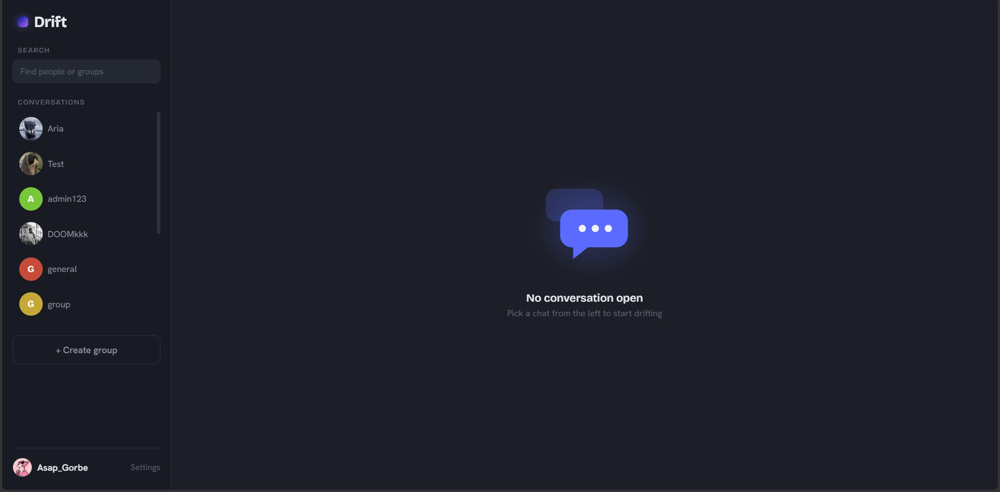

# Drift

> A self-hosted, real-time web messenger — accounts, group rooms, 1:1 DMs, live presence, and editable messages. Built from scratch with Flask and WebSockets, no frontend framework.

<!-- The repo's "spy on people" tagline is a joke — Drift is an ordinary chat app. -->



---

## Features

- **Real-time messaging** over WebSockets, with history persisted and replayed on join
- **Edit and delete** your own messages, live across all clients
- **Public and private group rooms** plus **1:1 direct messages**
- **Group lifecycle:** create groups (name, photo, description, public/private), owner-only editing, invite links for private groups, member list, leave a group, owner-only delete
- **Live presence** — online/offline status in DMs
- **Per-conversation unread badges** in a Telegram-style sidebar
- **User avatars and group photos** (uploads validated server-side)
- **Account security:** bcrypt password hashing, security-question password reset, and an in-app settings panel to change your password or security question
- **Search** for people and groups

## Tech stack

| Layer | Choice |
| --- | --- |
| Backend | Python, Flask |
| Real-time | Flask-SocketIO (eventlet) over WebSockets |
| Database | PostgreSQL via psycopg2 (pooled connections) |
| Auth & safety | bcrypt, Flask sessions, Flask-WTF (CSRF), Flask-Limiter (rate limits), Pillow (upload validation), MarkupSafe |
| Frontend | Vanilla JavaScript, HTML, CSS |
| Config | python-dotenv |

## Architecture at a glance

- A single Flask app serves the HTML and exposes both HTTP routes (auth, group management, uploads) and Socket.IO events (messaging, presence, search).
- On connect, a socket **subscribes to every room the user belongs to**, so messages from background conversations still reach the browser and drive unread badges.
- Each message is a structured payload (`id`, `sender`, `text`, `time`, `room`); the client renders text via `textContent`, which is the XSS barrier.
- Direct messages are ordinary private rooms named `dm_<lowId>_<highId>`.
- Database access goes through a `ThreadedConnectionPool` behind a `get_db()` context manager; all SQL is parameterized.

## Getting started (local)

**Prerequisites:** Python 3.12, PostgreSQL.

```bash
# 1. clone and enter
git clone https://github.com/Asap-Gorbe/Drift.git
cd Drift

# 2. virtual environment + dependencies
python -m venv venv
source venv/bin/activate        # Windows: venv\Scripts\activate
pip install -r requirements.txt # see note below if this file doesn't exist yet

# 3. create the database
createdb drift                  # or: sudo -u postgres createdb drift

# 4. configure environment (see .env below)
cp .env.example .env            # then edit values

# 5. create the schema (see "Database schema" below), then run
python app.py
```

The app starts on `http://127.0.0.1:5000`.

> **requirements.txt:** if the repo doesn't have one yet, generate it from your working venv with `pip freeze > requirements.txt`. Core packages: `flask`, `flask-socketio`, `eventlet`, `psycopg2-binary`, `bcrypt`, `flask-wtf`, `flask-limiter`, `pillow`, `python-dotenv`.

### Environment variables (`.env`)

```ini
DB_PASSWORD=your_postgres_password   # required — app refuses to start without it
SECRET_KEY=a_long_random_string      # required — used to sign sessions
SESSION_COOKIE_SECURE=true           # set true in production (HTTPS); leave unset for local http
FLASK_DEBUG=false                    # gate debug mode behind this
```

### Database schema

Drift expects the following tables. (Reconstructed from the app's queries — run `pg_dump --schema-only drift` to capture your canonical schema.)

```sql
CREATE TABLE users (
    id                SERIAL PRIMARY KEY,
    username          TEXT UNIQUE NOT NULL,
    password          TEXT NOT NULL,          -- bcrypt hash
    avatar            TEXT,                   -- filename, nullable
    security_question TEXT,                   -- nullable
    security_answer   TEXT                    -- bcrypt hash of normalized answer, nullable
);

CREATE TABLE rooms (
    id           SERIAL PRIMARY KEY,
    name         TEXT NOT NULL,
    is_private   BOOLEAN NOT NULL DEFAULT FALSE,
    invite_token TEXT,                         -- private rooms only
    owner_id     INTEGER REFERENCES users(id) ON DELETE SET NULL,
    description  TEXT,
    photo        TEXT                          -- filename
);

CREATE TABLE messages (
    id         SERIAL PRIMARY KEY,
    user_id    INTEGER REFERENCES users(id),
    room_id    INTEGER REFERENCES rooms(id),
    content    TEXT NOT NULL,
    created_at TIMESTAMP NOT NULL DEFAULT now()
);

CREATE TABLE room_members (
    room_id INTEGER REFERENCES rooms(id),
    user_id INTEGER REFERENCES users(id),
    PRIMARY KEY (room_id, user_id)
);
```

## Deployment

Drift runs on a small Ubuntu VPS behind nginx:

- **systemd** service runs `python app.py` (eventlet) and restarts on failure.
- **nginx** reverse-proxies to the app and upgrades the WebSocket connection.
- **Let's Encrypt** TLS (DNS-01 challenge).
- A **swap file** helps on low-RAM instances.

**Deploying updates.** Where the server's direct GitHub access is unreliable, the reliable path is a git bundle rather than `git pull`:

```bash
# on the dev machine (has working internet)
git bundle create driftfix.bundle master
scp driftfix.bundle user@server:/home/user/Drift/

# on the server
cd /home/user/Drift
git fetch driftfix.bundle master && git reset --hard FETCH_HEAD
sudo systemctl restart drift
```

Run any pending database migrations **before** restarting the service.

## Security notes

- Passwords and security-question answers are bcrypt-hashed; answers are normalized before hashing.
- CSRF protection on all state-changing routes (hidden token in forms, `X-CSRFToken` header on fetches).
- Required `SECRET_KEY` and `DB_PASSWORD` at startup; debug mode gated behind an env var.
- Rate limiting on auth and group routes.
- Uploaded images validated with Pillow; message output rendered via `textContent`.
- Security questions are weaker than email-based reset — an accepted tradeoff for a friends-scale app.

## Status

Drift was built as a learning project and is feature-complete for its scope. Possible future work: owner-initiated member removal, typing indicators, group-wide presence, and a richer message-bubble style.

## License

<!-- Choose one — e.g. MIT — or remove this section. -->
